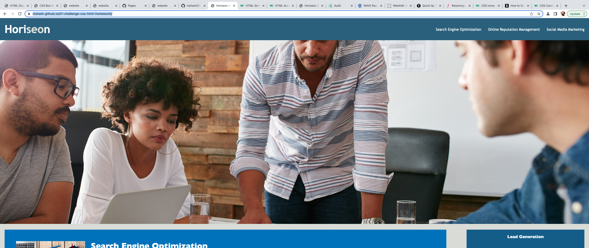
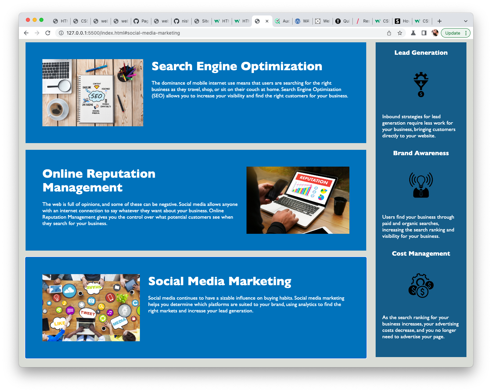

# 01 HTML, CSS, and Git: Code Refactor - Accessibility Home Work

## Description
An increasingly important consideration for businesses, web accessibility ensures that people with disabilities can access a website using assistive technologies like video captions, screen readers, and braille keyboards. Accessibility is good for business—for one thing, accessible sites rank higher in search engines like Google. It also helps companies avoid litigation, which might arise if people with disabilities can't access a website.

Accessibility can include complex requirements, these criteria are documented in the Acceptance Criteria section.

Improved the codebase for long-term sustainability. 

## User Story

```
AS A marketing agency
I WANT a codebase that follows accessibility standards
SO THAT our own site is optimized for search engines
```

## Acceptance Criteria

```
GIVEN a webpage meets accessibility standards
WHEN I view the source code
THEN I find semantic HTML elements
WHEN I view the structure of the HTML elements
THEN I find that the elements follow a logical structure independent of styling and positioning
WHEN I view the icon and image elements
THEN I find accessible alt attributes
WHEN I view the heading attributes
THEN they fall in sequential order
WHEN I view the title element
THEN I find a concise, descriptive title
```

## Screenshot

Please find the screenshot of the application:


Continuation of the screenshot:


### Deployment link and Git repo 

* The URL of the deployed application: https://nisha4r.github.io/01-challenge-css-html-homework/

* The URL of the GitHub repository: 

GIT repo: https://github.com/nisha4r/01-challenge-css-html-homework#readme
---
© 2023 edX Boot Camps LLC. Confidential and Proprietary. All Rights Reserved.
